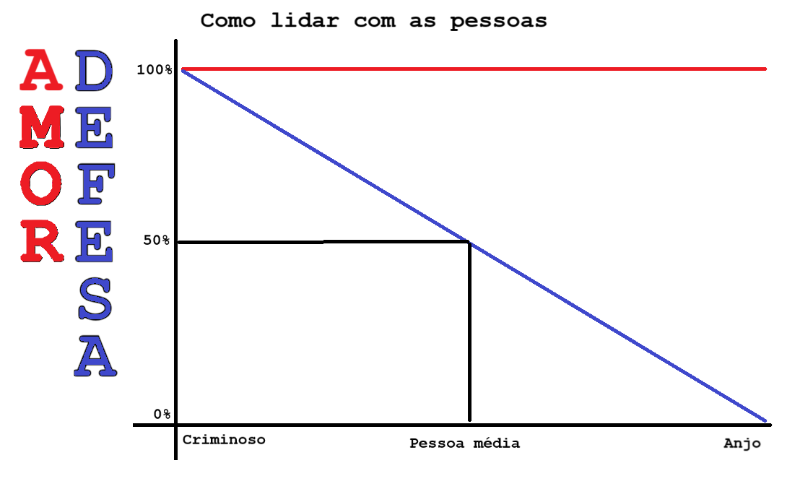

# Defesa:
    
    Para não deixar o destino em mãos alheias:
        O maior interessado é quem deve tomar a iniciativa a favor de si mesmo
        
    Para evitar se roubado:
        Aprender a não ostentação
        
    Para evitar cair em fake news:
        Desconfiar, confirmar, validar, antes de acreditar
        
    Para não cair em golpes:
        Aprender a identificar o padrão dos estelionatários:
            "para ganhar algo fácil ou que se deseja muito, primeiro
            invista este relativamente pequeno valor ..."
    
    Para repelir a pessoa que pede o que ela mesma pode fazer, ou o que não é nossa obrigação:
        Aprender a dizer não
        Usar o silêncio como negativa
        Aprender a mentira defensiva:
            não tenho - quando melhor que "tenho mas não te dou",
            não posso - quando melhor que "posso mas não farei"
            sim farei (e não fazer) - quando melhor que "não farei"
    
    Para repelir a competição danosa:
        Mentira defensiva:
            você está certo - ao invés de discussões intermináveis
            você é melhor que eu - ao invés de disputas intermináveis
    
    Para alertar a quem importuna:
        Usar a crítica: "vai ficar me perseguindo?" ou "vai ficar repetindo sem parar?"
    
    Para evitar pessoas tóxicas:
        Afastamento, diminuir o contato (sem cortar a pessoa, mínimo de afastamento)
        Ex: não morar junto, não competir, não discutir
    
    Para evitar a agressão:
        Fugir
        Pedir ajuda
        Autodefesa (menor violência possível)
    
    Para corrigir e educar:
        Castigo

# Amor:
    Profundo senso de respeito aos direitos humanos em todas as pessoas:
        Vida
        Liberdade
        Igualdade
        Dignidade
        Propriedade

